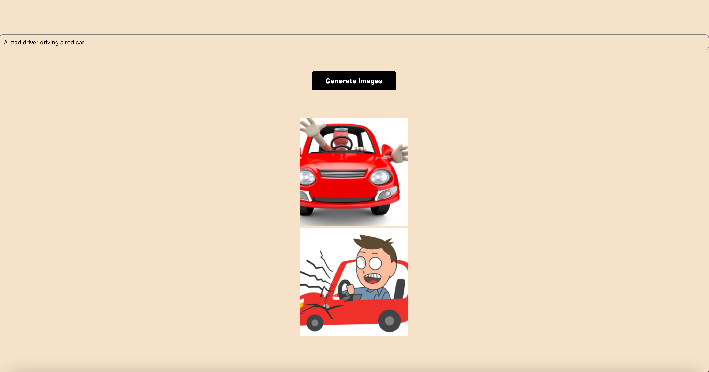

# AI Image Generating App Utilizing OpenAI API

## how to get started

_Warning:_ This program needs the following downloads to run successfully

```

$ node --version
v21.1.0
$ npm --version
10.4.0
$ nvm --version
0.39.7
$ npx --version
10.2.4
```
1. Checkout this project
2. Get OpenAI key and replace in App.js file
3. Run following command
```

npm run web

```

4. This program should be opened on a page in a browser, if it doesn't, then open it in a browser and type the following URL
```

```
http://localhost:8081/

[local page](http://localhost:8081/)

```

5. Type the prompt to generate images

## Sample image located below



